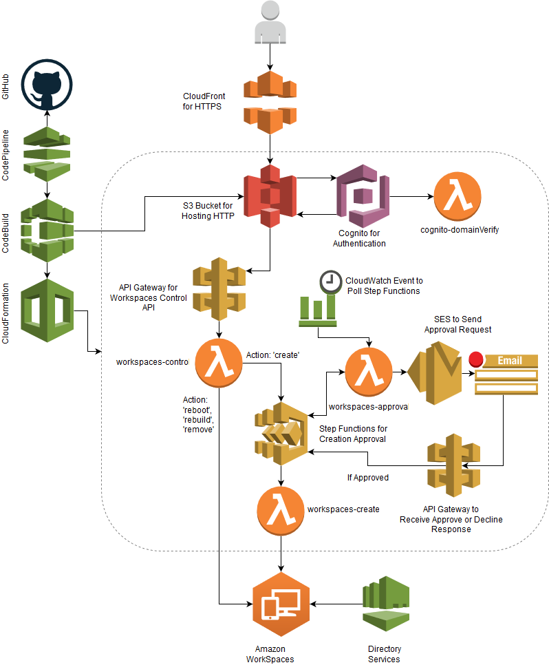
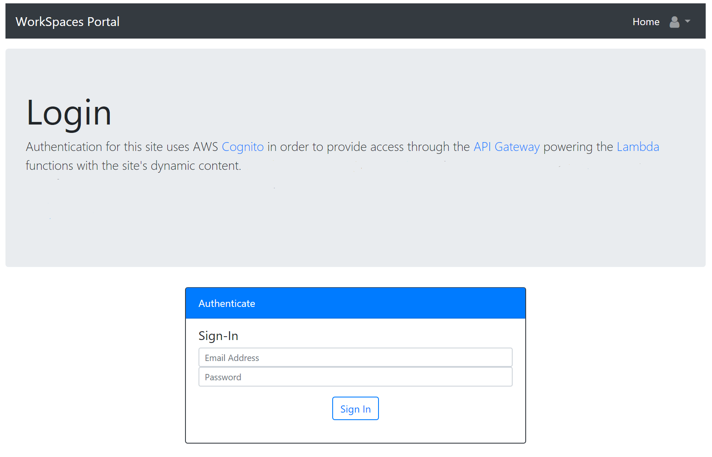
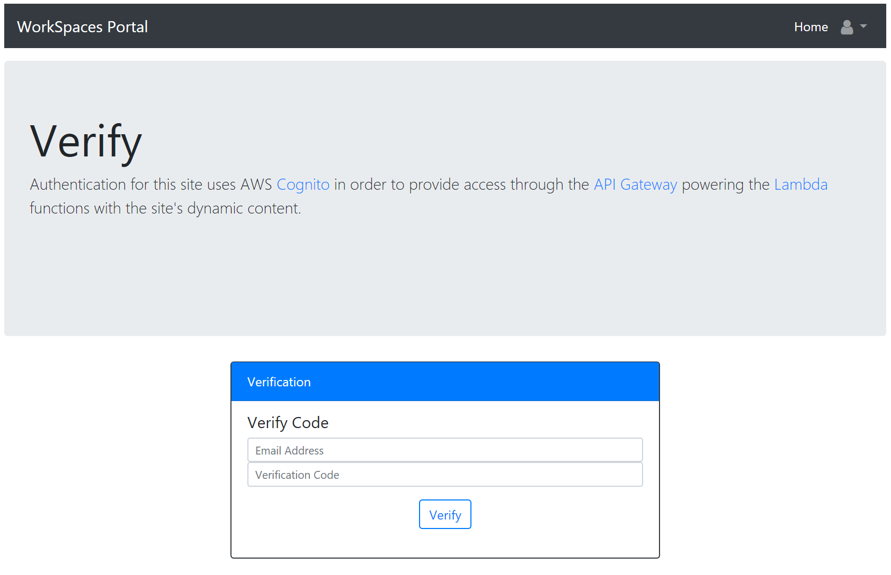
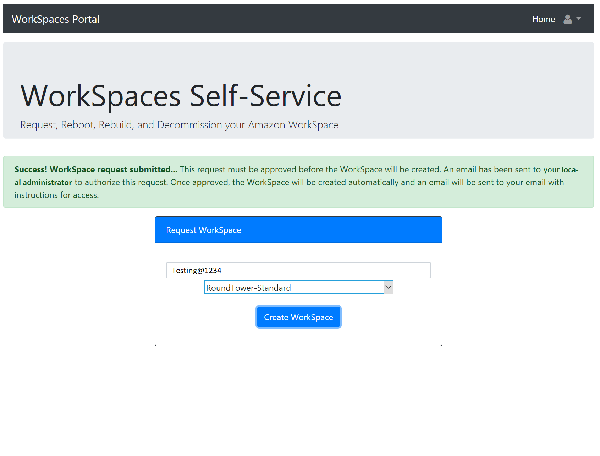
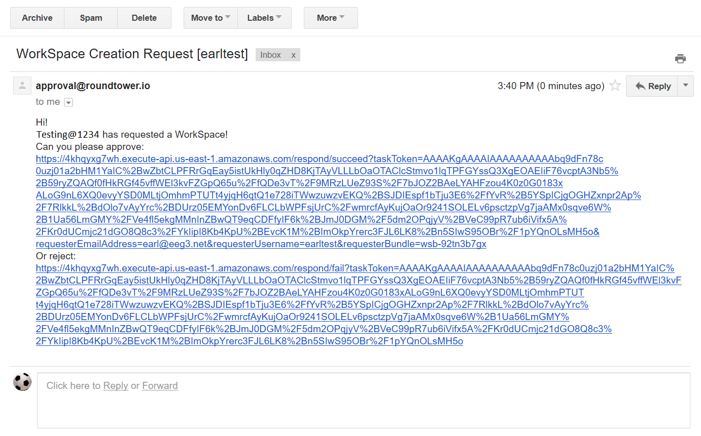
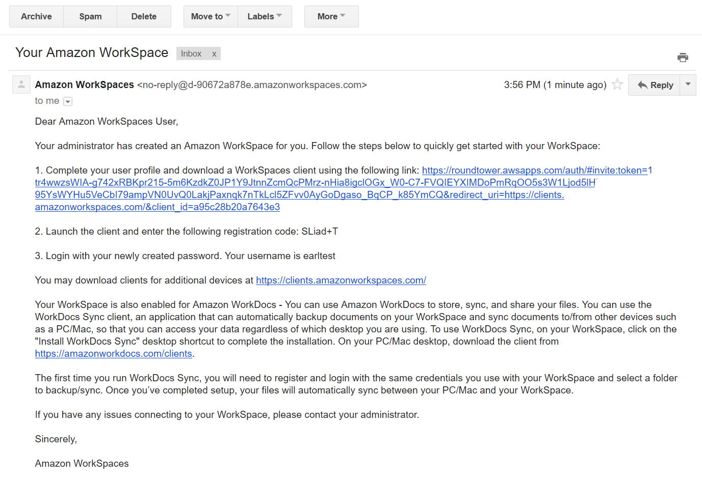

# WorkSpaces Portal

The WorkSpaces Portal provides Self-Service capability to end-users for Amazon WorkSpaces virtual desktops. The portal provides the ability for users to create, rebuild, reboot, and delete their WorkSpace. The application is entirely serverless leveraging AWS Lambda, S3, API Gateway, Step Functions, Cognito, and SES. The application provides continuous deployment through AWS CodePipeline, CodeBuild, CloudFormation with SAM, and GitHub.

## Architecture

### Components Overview

This project leverages the following services:

* [CloudFormation](https://aws.amazon.com/cloudformation/): Used to deploy the entire stack.
* [AWS Serverless Application Model](https://aws.amazon.com/about-aws/whats-new/2016/11/introducing-the-aws-serverless-application-model/): Used to provision Lambda/API Gateway.
* [S3](https://aws.amazon.com/s3/): Used to provide static website hosting and to store our build artifacts.
* [Lambda](https://aws.amazon.com/lambda/): Used to perform Functions-as-a-Service. These can be tested with events in corresponding sample_events/ folder using [lambda-local](https://www.npmjs.com/package/lambda-local).
* [API Gateway](https://aws.amazon.com/api-gateway/): Used to provide an integration point to our Lambda functions.
* [Step Functions](https://aws.amazon.com/step-functions/): Used to provide a State Machine for Approval workflows.
* [Cognito](https://aws.amazon.com/cognito/): Used to provide authentication for our website.
* [SES](https://aws.amazon.com/ses/): Used to send Approval emails.
* [CloudWatch Events](https://docs.aws.amazon.com/AmazonCloudWatch/latest/events/WhatIsCloudWatchEvents.html): Used to set a timer event for Lambda functions.
* [IAM](https://aws.amazon.com/iam/): Provides security controls for our process.
* [CloudFront](https://aws.amazon.com/cloudfront/): Provides HTTPS in front of S3 web site.
* [CodePipeline](https://aws.amazon.com/codepipeline/): Used to provide the pipeline functionality for our CI/CD process.
* [Code Build](https://aws.amazon.com/codebuild/): Used to build the project as part of CodePipeline process. 
* [GitHub](http://www.github.com): Used as the source code repository. Could theoretically be replaced with CodeCommit.
* [Jekyll](http://www.jekyllrb.com): Provides static web site generation to convert the `website/` directory.

## Usage

### User Account Creation

Users can create their accounts through the register page. Anyone with an email on the Approved Domain as specified in the stack can register. 

After registering, users will receive a verification token through email. The user must enter this token on the verification page. Users are automatically redirected to the verify page after registering; however, they can also access it by accessing the site and browsing the verify from the top-right dropdown.

Once verified, the user can sign in to the portal with their created credentials. 

### Creating a WorkSpace

Upon signing in, they will see the WorkSpace Request form as they have not created a WorkSpace yet. They can submit a request which will start the Approval process.

The Approver email as specified within the stack will receive an email with links to Approve or Reject the request.

Upon signing in, they will see the WorkSpace Request form as they have not created a WorkSpace yet.

Once approved, the WorkSpace will begin automatically and immediately.

### Managing a WorkSpace

After the WorkSpace is provisioned, the user will receive an email directly from Amazon with details on how to access their WorkSpace.

They can also begin managing the WorkSpace through the portal: rebuild, reboot, or delete.

## Removal

1. CloudFormation -> Delete Child Stack (e.g. appname-serverless-stack).
2. CloudFormation -> Delete Parent Stack (e.g. appname)
3. Delete all WorkSpaces created (if desired).
4. Delete the Directory Services directory (if desired).
5. Delete the `workspaces-portal` API Gateway.
6. Delete the created S3 Buckets (e.g. AppName-Bucket & serverless-app-<ACCOUNTID>-<REGION>-AppName).
7. Delete the CloudFront Web Distribution.

## Updating

As the website or serverless function is updated, simply perform the modifications within the code and then push them to the GitHub repo. Once checked in to GitHub, CodePipeline will handle the rest automatically. To test this functionality, browse to the CodePipeline page and view the pipeline while pushing a change. The pipeline will show the process from Source -> Build -> Deploy. If there are any failures, they will be visible within the pipeline.

The code for the pipeline resides within the root of the project, and the pipeline itself exists as part of the parent CloudFormation stack:

1. **deploy.json**: Launcher for the core services within CloudFormation (S3, CodePipeline, CodeBuild, Cognito). These are not modified by the pipeline on changes, but it does include setting up the pipeline itself. This is the CloudFormation template to launch to get setup started.
2. **buildspec.yml**: This file is used by CodeBuild to tell it what to do on every build, such as running jekyll and copying the output to S3.
**wsportal.json**: CloudFormation Serverless Transformation template for SAM. This template handles creation of the Lambda functions, Step Functions, and the approval API Gateway.

## Notes

1. If you want to delete the stack, make sure to delete the pipeline-created stack first and then delete the parent stack. If you delete the parent first, the IAM role is deleted and you'll have to tinker around with permissions to get the stack to actually gracefully delete.
2. Some of the IAM permissions may be more liberal than preferred. Please review and edit to match to your security policies as appropriate.

